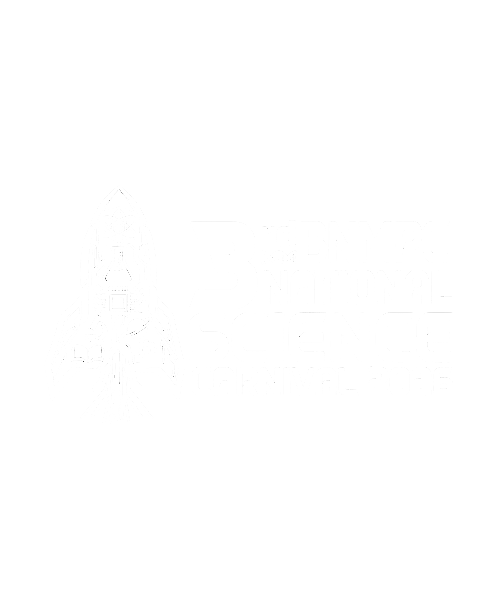
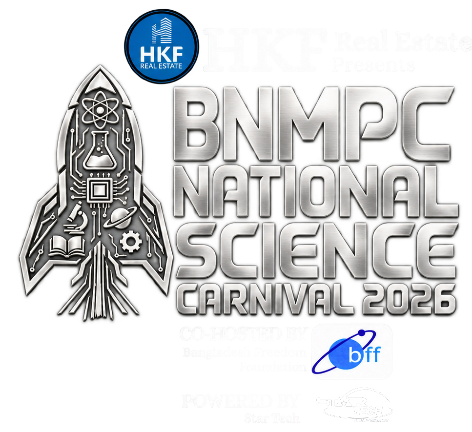

# BNMPC Science Carnival Website — Edit Guide

The website is divided into clearly labelled sections so that each part can be edited separately.

## 1. Homepage

File: `dist/index.html`

- `01. CINEMATIC LOADING SCREEN` — loading-logo upload area
- `02. HOMEPAGE HERO` — navigation, event logo, date, location and countdown
- `03. CLUB DETAILS` — club logo, description, facts and links
- `04. Shared popup mount` — connects the shared JavaScript

## 2. Homepage Background

File: `dist/styles.css`

At the top, find `01. DESIGN TOKENS` and change:

```css
--home-bg-image: none;
```

to:

```css
--home-bg-image: url("assets/your-background-file.jpg");
```

Then place the background image inside `dist/assets/`.

## 3. Loading Logo

File: `dist/index.html`

Find `01. CINEMATIC LOADING SCREEN`. Replace the `.loading-logo-slot` element with an image, for example:

```html

```

## 4. Homepage Event Logo

File: `dist/index.html`

Find `02B. Large centered event-logo upload slot`. Replace `.home-logo-slot` with:

```html

```

## 5. Events

File: `dist/events.html`

Each event is inside a separate `<article class="event-card">`. Update its title, description and `data-` information independently.

## 6. Schedule

File: `dist/schedule.html`

- `04A. Day 1 chart`
- `04B. Day 2 chart`
- `04C. Day 3 chart`

Each schedule row is a `.timeline-item` containing time, category, title and optional details.

## 7. Organizing Committee

File: `dist/committee.html`

- `04A. STUDENT COMMITTEE` — student posts, photos and names
- `04B. TEACHER COMMITTEE` — Moderator and Co-Moderator

Inside each `.member-photo`, replace `<span>Photo</span>` with a real image, for example ``. Then replace `Name to be updated` with the member's name.

## 8. Registration Forms and Interactions

File: `dist/script.js`

The file is divided into 10 numbered sections covering popups, visitor registration, participant registration, schedule scrolling, committee tabs, countdown and logo movement.

## 9. Main Design

File: `dist/styles.css`

The stylesheet is divided into numbered sections for design tokens, homepage, navigation, schedule, committee, forms, animations and responsive layouts.
